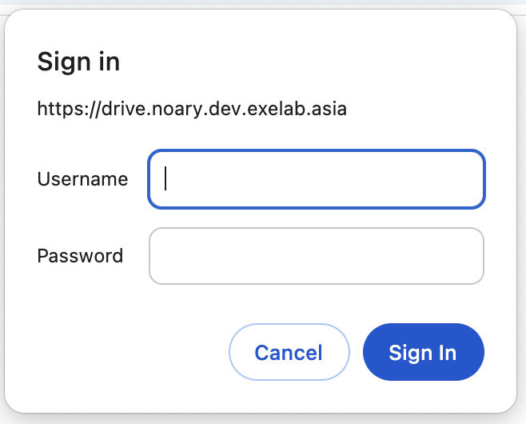
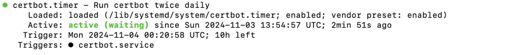

# Deployment

## Table of Contents

1.  [Add Swap Space on Ubuntu](#add-swap-space-on-ubuntu)

    1.1 [Checking the system for Swap information](#checking-the-system-for-swap-information)

    1.2 [Checking available space on the Hard Drive Partition](#checking-available-space-on-the-hard-drive-partition)

    1.3 [Creating a Swap file](#creating-a-swap-file)

    1.4 [Enabling the Swap File](#enabling-the-swap-file)

    1.5 [Making the Swap file permanent](#making-the-swap-file-permanent)

[2. Pull source, build and load image](#2.-pullsource,buildandloadimage)

    2.1 [Pull source](#pull-source)

    2.2 [Build and load image](#build-and-load-image)

3.  [Setup Nginx](#setupnginx)

    3.1 [Install Nginx](#install-nginx)

    3.2 [Adjusting the firewall](#adjusting-the-firewall)

    3.3 [Checking web server](#checking-web-server)

    3.4 [Managing the Nginx Process](#managing-the-nginx-process)

    3.5 [Setting up server blocks](#setting-up-server-blocks)

    3.6 [Nginx Files and Directories](#nginx-files-and-directories)

4.  [Setup Password Authentication](#setuppasswordauthentication)

    4.1 [Create the password file using Apache Utilities](#create-the-password-file-using-apache-utilities)

    4.2 [Configure Nginx Password Authentication](#configure-nginx-password-authentication)

5.  [Secure Nginx with Let's Encrypt](#secure-nginx-with-let's-encrypt)

    5.1 [Secure Nginx with Let's Encrypt](#secure-nginx-with-let's-encrypt)

    5.2 [Allowing HTTPS Through the Firewall](#allowing-https-through-the-firewall)

    5.3 [Obtaining an SSL Certificate](#obtaining-an-ssl-certificate)

    5.4 [Verifying Certbot Auto Renewal](#verifying-certbot-auto-renewal)

6.  [References](#references)

## 1. Add Swap Space on Ubuntu

<details>

- Swap is a portion of hard drive storage that has been set aside for the operating system to temporarily store data that it can no longer hold in RAM.
- This lets you increase the amount of information that your server can keep in its working memory.

### 1.1 Checking the system for Swap information

- Can see if the system has any configuration swap by typing: `sudo swapon --show`

  - If you don't get back any output, your system doesn't have swap space available.

- Can verify that there is no active swap using the `free` utility: `free -h`

```
Output
              total        used        free      shared  buff/cache   available
Mem:          981Mi       122Mi       647Mi       0.0Ki       211Mi       714Mi
Swap:            0B          0B          0B
```

### 1.2 Checking available space on the Hard Drive Partition

- Before we create our swap file, we'll check our current disk usage to make sure enough space: `df -h`

```
Output
Filesystem      Size  Used Avail Use% Mounted on
udev            474M     0  474M   0% /dev
tmpfs            99M  932K   98M   1% /run
/dev/vda1        25G  1.4G   23G   7% /
tmpfs           491M     0  491M   0% /dev/shm
tmpfs           5.0M     0  5.0M   0% /run/lock
tmpfs           491M     0  491M   0% /sys/fs/cgroup
/dev/vda15      105M  3.9M  101M   4% /boot/efi
/dev/loop0       55M   55M     0 100% /snap/core18/1705
/dev/loop1       69M   69M     0 100% /snap/lxd/14804
/dev/loop2       28M   28M     0 100% /snap/snapd/7264
tmpfs            99M     0   99M   0% /run/user/1000
```

- The device with `/` in the `Mounted on` is dish. We have plenty of space available.

### 1.3 Creating a Swap file

- We can create a `swapfile` in our root (`/`) directory with the `fallocate` program.

  `sudo fallocate -l <1G> /swapfile`

- Verify that the correct amount of space was reserved: `ls -lh /swapfile`

  ```
  Output
  -rw-r--r-- 1 root root 1.0G Nov  1 02:34 /swapfile
  ```

### 1.4 Enabling the Swap File

- Make the file only accessible to **root**: `sudo chmod 600 /swapfile`
- Verify the permissions change: `ls -lh /swapfile`

  ```
  Output
  -rw------- 1 root root 1.0G Nov  1 02:34 /swapfile
  ```

- Mark the file as swap space: `sudo mkswap /swapfile`

  ```
  Output
  Setting up swapspace version 1, size = 1024 MiB (1073737728 bytes)
  no label, UUID=6e965805-2ab9-450f-aed6-577e74089dbf
  ```

- Enable the swap file, allowing our system to start using it: `sudo swapon /swapfile`

- Verify that the swap is available: `sudo swapon --show`

  ```
  Output

  NAME TYPE SIZE USED PRIO
  /swapfile file 1024M 0B -2
  ```

### 1.5 Making the Swap file permanent

- Our recent changes have enabled the swap file for the current session. If we reboot, the server will not retain the swap settings automatically.
- We can change this by adding the swap file to our `/etc/fstab` file.

- Back up the `/etc/fstab` file in case anything goes wrong: `sudo cp /etc/fstab /etc/fstab.bak`

- Add the swap file information to the end of your `/etc/fstab`: `echo '/swapfile none swap sw 0 0' | sudo tee -a /etc/fstab`

</details>

## 2. Pull source, build and load image

<details>

### 2.1 Pull source

- If you currently have password-based access to a server, you can copy your public key to it by issuing this command:
  `ssh-copy-id -i <identity_file> <remote_server>`

- Clone source using web url: `git clone <HTTPS_URL>`

- Enter username and password = Personal access tokens

### 2.2 Build and load image

- Build image with `--platform linux/amd64`:

  `docker build -t <image_name:tag> .`

  - If you have `docker-compose.yml` file, run: `docker compose build`

- Load image:

  `docker save <image_name:tag> | ssh <remote_server> sudo docker load`

- Run container:

  `docker run -d -p <port_host:port_container> --name <container_name> <image_name:tag>`

  - If you have `docker-compose.yml` file, run: `docker compose up -d`

</details>

## 3. Setup Nginx

<details>

### 3.1 Install Nginx

```
sudo apt update
sudo apt install nginx
```

### 3.2 Adjusting the firewall

- Before testing Nginx, the firewall software needs to be adjusted to allow access to the service.
- UFW (Uncomplicated Firewall) is a configuration tool, included by default within Ubuntu. It provides a streamlined interface for configuring common firewall use cases via the command line.

- Get list of the application profiles: `sudo ufw app list`

```
Output
Available applications:
  Nginx Full           # This profile opens both port 80 (normal) and port 443 (TLS/SSL)
  Nginx HTTP           # This profile opens only port 80
  Nginx HTTPS          # This profile opens only port 443
  OpenSSH
```

- Verify UFW status: `sudo ufw status`

```
Output
Status: active

To                         Action      From
--                         ------      ----
OpenSSH                    ALLOW       Anywhere
Nginx HTTP                 ALLOW       Anywhere
OpenSSH (v6)               ALLOW       Anywhere (v6)
Nginx HTTP (v6)            ALLOW       Anywhere (v6)
```

### 3.3 Checking web server

- To make sure the service is running by typing: `systemctl status nginx` or `sudo service nginx status`

```
Output
● nginx.service - A high performance web server and a reverse proxy server
   Loaded: loaded (/lib/systemd/system/nginx.service; enabled; vendor preset: enabled)
   Active: active (running) since Fri 2020-04-20 16:08:19 UTC; 3 days ago
     Docs: man:nginx(8)
 Main PID: 2369 (nginx)
    Tasks: 2 (limit: 1153)
   Memory: 3.5M
   CGroup: /system.slice/nginx.service
           ├─2369 nginx: master process /usr/sbin/nginx -g daemon on; master_process on;
           └─2380 nginx: worker process
```

- Enter server's IP address, you can access the default Nginx landing page. `http://your_server_ip`

<div style="text-align: center">
    
</div>

### 3.4 Managing the Nginx Process

- To stop web server: `sudo systemctl stop nginx` or `sudo service nginx stop`
- To start web server: `sudo systemctl start nginx` or `sudo service nginx start`
- To stop and restart: `sudo systemctl restart nginx` or `sudo service nginx restart`

### 3.5 Setting up server blocks

- When using the Nginx web server, **_server blocks_** (similar to virtual hosts in Apache) can be used to encapsulate configuration details and host more than one domain from a single server.
- In order for Nginx to serve contents, it's necessary to create a server block with the correct directives.

  `sudo nano /etc/nginx/sites-available/your_domain` **_(sudo nano /etc/nginx/sites-available/drive.noary.dev.exelab.asia)_**

- Create configuration block

```
Example: /etc/nginx/sites-available/drive.noary.dev.exelab.asia

server {
  server_name drive.noary.dev.exelab.asia www.drive.noary.dev.exelab.asia;

  proxy_set_header  Host $host;
  proxy_set_header  X-Forwarded-For $proxy_add_x_forwarded_for;
  proxy_set_header  X-Forwarded-Proto $scheme;
  # proxy_set_header  X-Forwarded-Ssl on;
  proxy_set_header  X-Forwarded-Port $server_port;
  proxy_set_header  X-Forwarded-Host $host;

  location / {
    proxy_pass http://0.0.0.0:4000;
  }

  proxy_busy_buffers_size   512k;
  proxy_buffers   4 512k;
  proxy_buffer_size   256k;


  listen [::]:443 ssl ipv6only=on; # managed by Certbot
  listen 443 ssl http2; # managed by Certbot
  ssl_certificate /etc/letsencrypt/live/drive.noary.dev.exelab.asia/fullchain.pem; # managed by Certbot
  ssl_certificate_key /etc/letsencrypt/live/drive.noary.dev.exelab.asia/privkey.pem; # managed by Certbot
  include /etc/letsencrypt/options-ssl-nginx.conf; # managed by Certbot
  ssl_dhparam /etc/letsencrypt/ssl-dhparams.pem; # managed by Certbot

}

server {
  if ($host = drive.noary.dev.exelab.asia) {
    return 301 https://$host$request_uri;
  } # managed by Certbot


  server_name drive.noary.dev.exelab.asia www.drive.noary.dev.exelab.asia;
  listen 80;
  return 404; # managed by Certbot
}

```

- Let's enable the file by creating a link from it to the `sites-enabled` directory, which Nginx reads from during startup

  `sudo ln -s /etc/nginx/sites-available/your_domain /etc/nginx/sites-enabled/` **_(sudo ln -s /etc/nginx/sites-available/drive.noary.dev.exelab.asia /etc/nginx/sites-enabled/)_**

  - Two server blocks are now enabled
    - `your_domain`: Will respond to requests for `your_domain` or `www.your_domain`
    - `default`: Will respond to any request on port 80 that do not match the other two blocks (Can be deleted)

- Test to make sure that there are no syntax errors in any of your Nginx files: `sudo nginx -t`

- Restart Nginx to enable your changes: `sudo systemctl restart nginx` or `sudo service nginx restart`

### 3.6 Nginx Files and Directories

**3.6.1. Content**

- `/var/www/html`: The actual web content, which by default only consists of the default Nginx page. This can changed by Nginx configuration files

**3.6.2. Server configuration**

- `/etc/nginx`: The Nginx configuration directory. All of the Nginx configuration files reside here.
- `/etc/nginx/nginx.conf`: The main Nginx configuration file. This can be modified to make changes to the Nginx global configuration.
- `etc/nginx/sites-available/`: The directory where per-site server blocks can be stored. Nginx will not use the configuration files in this directory unless they are linked to the `sites-enabled` directory.
- `etc/nginx/sites-enabled`: The directory where enabled per-site server blocks are stored. These are created by linking to configuration files found in the `sites-available` directory.

**3.6.3. Server logs**

- `/var/log/nginx/access.log`: Every request to web server is recorded in this log.
- `/var/log/nginx/error.log`: Any Nginx error will be record in this log.

</details>

## 4. Setup Password Authentication

<details>

### 4.1 Create the password file using Apache Utilities

- Install `apache2-utils` package:

```
sudo apt-get update
sudo apt-get install apache2-util
```

- We can use `htpasswd` command to create a password file that Nginx can use to authenticate users. We will create a hidden file for this purpose called `.htpasswd` within `/etc/nginx` configuration directory.

- Add the `-c` option to create the specified file.

  `sudo htpasswd -c /etc/nginx/.htpasswd noary` **_(username = noary)_**

- After enter, you will be asked to supply and confirm a password for the user (noary)

- View the contents of the file, we can see the username and the encrypted password: `cat /etc/nginx/htpasswd`

### 4.2 Configure Nginx Password Authentication

- We have a file with our users and passwords in a format that Nginx can read, we need to configure Nginx to check this file before serving our content
- Opening up the server block configuration file

```
Example: /etc/nginx/sites-available/drive.noary.dev.exelab.asia

server {
  ...............

  location / {
    proxy_pass http://0.0.0.0:4000;

    // Add basic authentication
    **auth_basic "Restricted Content";**
    **auth_basic_user_file /etc/apache2/.htpasswd;**
  }

  location /api/ {

    // Remove basic authentication
    proxy_pass http://0.0.0.0:4000;
  }

 .................

}
```

- Save and close the file. Restart Nginx

<div style="text-align: center">
    
</div>

</details>

## 5. Secure Nginx with Let's Encrypt

<details>

- Let's Encrypt is a Certificate Authority that provides an easy way to obtain and install free `TLS/SSL certificates`, thereby enabling encrypted HTTPS on web server.
- Use `Certbot` to obtain a free SSL certificate for Nginx on Ubuntu

### 5.1 Install Certbot

- Install Certbot and it's Nginx plugin with apt: `sudo apt install certbot python3-certbot-nginx`

### 5.2 Allowing HTTPS Through the Firewall

- See the current setting by typing: `sudo ufw status`

```
Output
Status: active

To                         Action      From
--                         ------      ----
OpenSSH                    ALLOW       Anywhere
Nginx HTTP                 ALLOW       Anywhere
OpenSSH (v6)               ALLOW       Anywhere (v6)
Nginx HTTP (v6)            ALLOW       Anywhere (v6)
```

- Allow the Nginx Full and Delete Nginx HTTP profile

```
sudo ufw allow 'Nginx Full'
sudo ufw delete allow 'Nginx HTTP'
```

- Check status: `sudo ufw status`

```
Output
Status: active

To                         Action      From
--                         ------      ----
OpenSSH                    ALLOW       Anywhere
Nginx Full                 ALLOW       Anywhere
OpenSSH (v6)               ALLOW       Anywhere (v6)
Nginx Full (v6)            ALLOW       Anywhere (v6)
```

### 5.3 Obtaining an SSL Certificate

- Run certbot with the `--nginx` plugin, using `-d` to specify the domain names we'd like the certificate to be valid for.

  `sudo certbot --nginx -d <domain> -d www.<domain>`

- Certbot will wrap up with a message the process was successful and where certificates stored.
    <div style="text-align: center">
        
    </div>

- Try reloading your website using `https://`. It should indicate that the site is properly secured, usually with a lock icon.

### 5.4 Verifying Certbot Auto-renewal

- Let's Encrypt's certificates are only valid for ninety days.
- The `certbot` package takes care of this for us by adding a systemd timer that will run twice a day and automatically renew any certificate that's within thirty days of expiration.
- Query the status of the timer with `systemctl`:

  `sudo systemctl status cerbot.timer`

    <div style="text-align: center">
      
    </div>

- To test the renewal process, you can do a dry run with `certbot`

  `sudo cerbot renew --dry-run`

    <div style="text-align: center">
      
    </div>

  - If you see no errors, you're all set. When necessary, Certbot will renew your certificates and reload Nginx to pick up the changes.
  - If the automated renewal process ever fails, Let's Encrypt will send a message to the email you specified, warning you when your certificate is about to expire.

</details>

## 6. References

https://www.digitalocean.com/community/tutorials/how-to-install-nginx-on-ubuntu-20-04

https://www.digitalocean.com/community/tutorials/how-to-set-up-password-authentication-with-nginx-on-ubuntu-14-04

https://www.digitalocean.com/community/tutorials/how-to-secure-nginx-with-let-s-encrypt-on-ubuntu-20-04
